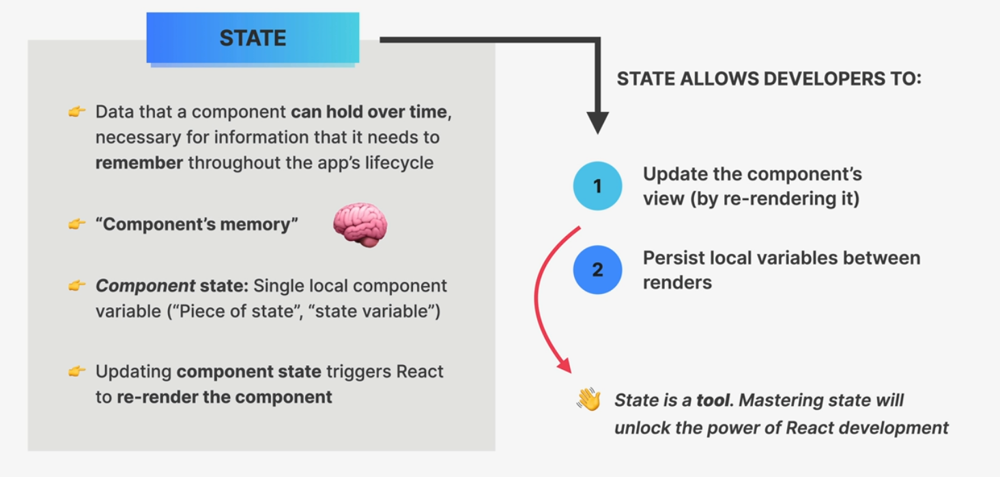
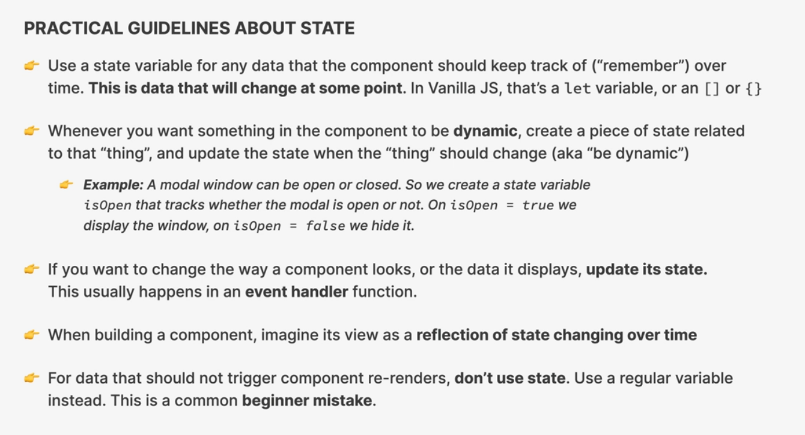
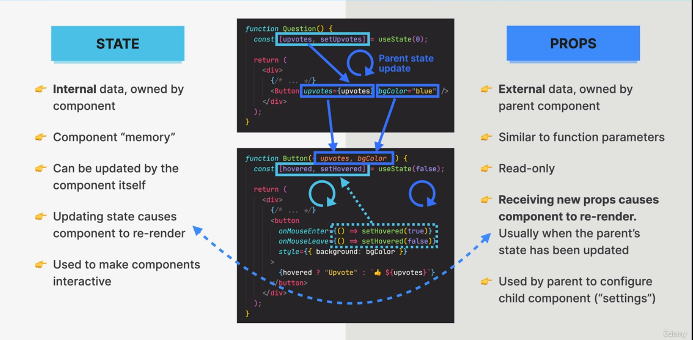

## Handling events

**Correct way to handle events in React:**

- Pass a function reference to the event handler, like this: `onClick={() => alert("previous")}`
- Ensure the event handler is a function that takes an event object as an argument

**Incorrect way to handle events in React:**

- Directly call the event handler function, like this: `OnMouseEnter={alert("wrong")}` (this will execute the function immediately)

**Correct prop name for mouse enter event:** `onMouseEnter` (lowercase "o")

```js
const handlePrevious = function(){
    alert("previous")
}
<button
  // right way
  onClick={() => alert("previous")}
  onClick={handlePrevious}

  //   wrong way
  onClick={alert("worng")}
  onClick={handlePrevious()}
>
  Previous
</button>
```

## What is State




- useState is a React hook that allows you to add state to functional components
- it is typically used in the top-level scope of a functional component
- It returns an array with two elements: the current state value and a function to update that value
- The update function is typically used in event handlers or other functions to update the state
- The state is re-rendered whenever the state value changes
- The state value should be immutable, meaning it should not be directly mutated, but rather replaced with a new value (do not set state manually)
- useState is typically used in combination with useEffect to handle side effects, such as fetching data from an API

```js
const [step, setStep] = useState(1);

function handleNext() {
  if (step < 3) setStep(step + 1);
}

function handlePrevious() {
  if (step > 1) setStep(step - 1);
}

// If we need to update the state based on the current state

function handlePrevious() {
  if (step > 1) {
    setStep((curStep) => s - 1);
    setStep((curStep) => s - 1);
  }
}
```

### practical state guideline



### State vs Props



## Controled elements

- In React, a controlled element is an input element (such as input, textarea, or select) whose value is controlled by the **component's state (by React)**. This means that the component's state is the single source of truth for the element's value, and the element's value is updated automatically when the state changes.

**Why not use dom?**

By controlling the input element's value through the component's state, React can:

- **Keep the state consistent**: Ensure that the input element's value is always in sync with the component's state.
- **Handle changes predictably**: React can handle changes to the input element's value in a predictable way, without worrying about the DOM getting out of sync.
- **Make it easier to manage state**: By controlling the input element's value through the component's state, React makes it easier to manage the application's state and handle complex interactions.

**3 steps to use this technic**

- Define a piece of state

```js
const [description, setDescription] = useState("");
```

- Use that piece of state on the element we want to control

```js
<input type="text" placeholder="Item..." value={description}></input>
```

- update the state

```js
<input
  type="text"
  placeholder="Item..."
  value={description}
  onChange={(e) => setDescription(e.target.value)}
></input>
```

## Coding challenge 1: (date counter)

https://codesandbox.io/p/sandbox/hzjghd

## Exercise
https://codesandbox.io/p/sandbox/bitter-lake-shhmww?workspaceId=ws_BXaTCjWtzwYJp8LKRsvaK3
